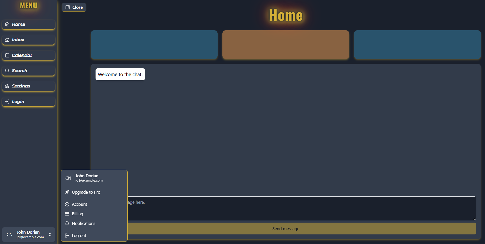

# 🚀 Connex - Kommunikationsplattform  

Connex ist eine Kommunikationsplattform, die Echtzeit-Chat, Sprach- und Videoübertragungen sowie viele weitere Funktionen bietet. Die Anwendung wird kontinuierlich weiterentwickelt und hat das Ziel, eine skalierbare und benutzerfreundliche Lösung für Online-Kommunikation zu schaffen.  

## 🔧 **Technologien:**  
- **Backend:** Express.js
- **Frontend:** React | TypeScript | TailwindCSS | ShadCN
- **Datenbanken:** MySQL
- **Cloud:** 
- **Weitere:** Docker, JWT, bcrypt, WebSocket

## 📂 **Features:**  
- **Echtzeit-Text-Chat:** Mit WebSocket
- **Sprach- und Videoübertragung:** 
- **Benutzerregistrierung und -anmeldung:** Mit JWT für Token-basierte Authentifizierung und bcrypt für Passwortsicherung.  
- **Dateiupload im Chat:** Benutzer können Dateien hochladen mit 
- **Benachrichtigungen:** Echtzeit-Benachrichtigungen über 
- **Profilmanagement und Themes:** Personalisierung von Benutzerprofilen.  
- **Cloud-Integration:** 

## 🛠 **Verwendete Tools & Frameworks:**  

- **ShadCN:** Für die Sidebar Buttons und andere Assets
- **Docker:** Containerisierung der Anwendung für eine flexible Bereitstellung  

## 📝 **Datenbanken:**  
- **MySQL:** 

## 🧪 **Testing:**  
- **:** 

## 📈 **Ziele:**  
- **Aktueller Status:** In aktiver Entwicklung  
- **Nächste Schritte:** Implementierung von Video-Übertragungen, Rollensystem, Profilmanagement und erweiterten Benachrichtigungen.  
- **Langfristige Ziele:** Skalierbarkeit verbessern, zusätzliche Funktionen wie Gruppenchats und erweiterte Sicherheitsfunktionen einbauen.  

---

**Hinweis:** Dieses Repository befindet sich derzeit in aktiver Entwicklung und wird noch aktualisiert. ✨  

